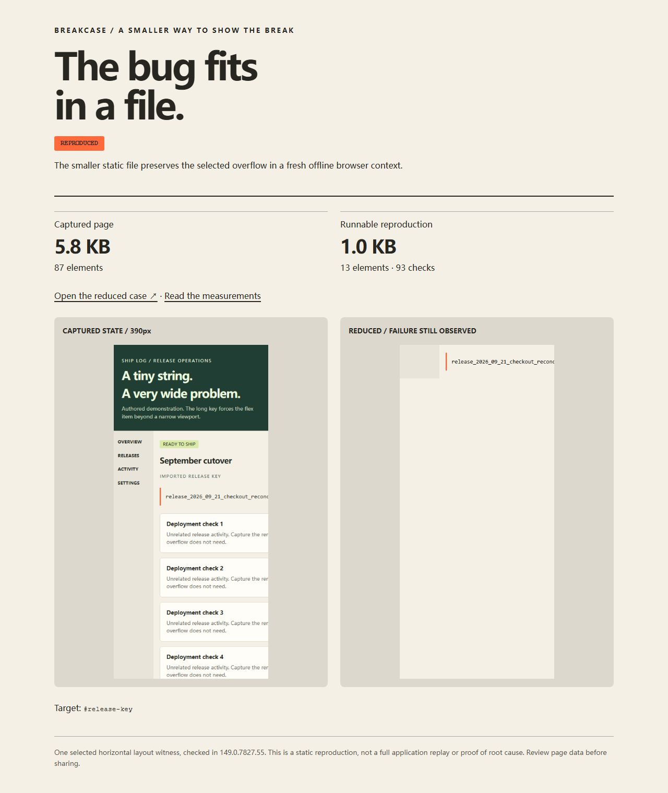

# Breakcase

**The bug fits in a file.**

Give Breakcase a page and the element that overflows. Get a smaller HTML/CSS
reproduction you can open without the app, its server, or a login session.



Built for coding agents that already found a layout problem and need a small
case to inspect or hand to a maintainer. One command supplies the overflow check,
static capture, DOM/CSS reduction, screenshots and independent offline recheck.
An existing Playwright Page can be passed directly, keeping the state the agent
already reached.

**Experimental preview.** The first version handles selected right-side document
overflow in Chromium. It has not demonstrated independent adoption or saved
agent time. [What we actually measured](docs/evaluation.md).

## Try the released package

Node.js 22+ is required. The package is distributed as a GitHub release tarball;
it is not published to the npm registry.

```sh
npm install --save-dev https://github.com/codex-improvement-lab/breakcase/releases/download/v0.1.0-alpha.3/codex-improvement-lab-breakcase-0.1.0-alpha.3.tgz
npx breakcase install-browser
npx breakcase demo --out ./demo-case
```

Open `demo-case/report.html`, then `demo-case/repro.html`. The demo contains an
authored long release key that breaks a narrow flex layout. It is not a customer
incident. Browser installation is explicit; capture makes no LLM/API calls and
uploads nothing.

From source:

```sh
git clone https://github.com/codex-improvement-lab/breakcase.git
cd breakcase
npm install --global pnpm@11.19.0
pnpm install --frozen-lockfile --ignore-scripts
node src/cli.js install-browser
node src/cli.js demo --out ./demo-case
```

Linux may also need Playwright's system libraries (`pnpm exec playwright install --with-deps chromium`).

## Use it on your page

```sh
npx breakcase reduce http://localhost:3000 \
  --selector '#release-key' --viewport 390x844 --out ./overflow-case --json

npx breakcase check ./overflow-case/repro.html \
  --result ./overflow-case/result.json --json
```

`--click '.open-panel'` can be repeated for simple preparation. For richer state,
use the Page API below. The default is a narrow **desktop** viewport, DPR 1;
`--mobile` explicitly enables mobile/touch emulation. A viewport is not a claim
of physical-device testing. Inputs may also be local HTML files. For multi-file
local apps, use their normal server so resources can be read with their normal URLs.

Output directory (an existing directory is never overwritten):

```text
overflow-case/
  repro.html     # the smaller runnable case
  result.json    # original/captured/final witness and work budget
  report.html    # before/after review
  capture.html   # static captured state before reduction
  capture.png
  repro.png
```

The files contain captured page content. Inspect them before sharing. Capture
removes scripts and blanks password inputs, but is not a secret scrubber or a
general security sanitizer. Breakcase does not modify your source files.

## Use the page your agent already has

```js
import { chromium } from 'playwright';
import { reduceOverflow } from '@codex-improvement-lab/breakcase';

const profile = {
  viewport: { width: 390, height: 844 },
  deviceScaleFactor: 1,
  isMobile: false,
};
const browser = await chromium.launch();
const page = await browser.newPage(profile);
await page.goto('http://localhost:3000');
await page.getByRole('button', { name: 'Open details' }).click();

const result = await reduceOverflow({
  page, profile,
  selector: '#release-key',
  outputDir: './overflow-case',
  maxChecks: 500,
  maxDurationMs: 30_000,
});
console.log(result.status, result.bytes);
await browser.close();
```

Pass the same profile used for your source context. Breakcase reads that Page
without navigating, scrolling, editing or closing it. Reduction happens in separate
contexts with scripts disabled and resource requests blocked. It does not search
your browser profiles, attach to your account or recover login credentials.

`maxChecks` (default `500`, range `1..10000`) and `maxDurationMs` (default
`30_000`, range `100..300000`) limit reduction work. The CLI equivalents are
`--max-checks` and `--max-ms`. The time limit covers the reduction phase;
source preparation, capture, screenshots and final reopening take additional
time. Reaching a limit retains the best accepted file and sets
`result.reduction.budgetLimited`. The output directory must not already exist.

## The selected witness

The selector must match exactly one rendered element. Both the document and the
selected element's visible right extent must exceed the viewport. Intentional
clipping/scroll containers constrain the extent; an unrelated overflow elsewhere
does not make a clipped target interesting.

Every accepted deletion must retain the target text digest, viewport width and
its document X, width, height, text width, scroll width and visible right extent
within one CSS pixel. It also retains visual viewport width within one CSS pixel
and visual scale within 0.001, so removing mobile viewport metadata cannot pass by
zooming the result out. A candidate may make the document narrower by removing
unrelated content, but may not make it more than one CSS pixel wider than the
source. This catches newly introduced page overflow without demanding that all
unrelated content survive. Scroll position is separate from document geometry.
The final file is opened in a fresh context and checked again.

New results use `witnessVersion: 3`. Old results remain checkable under their
recorded contract; `check` reports `visualViewportCompared: false` when an old
record lacks visual fields, and `documentWidthCapCompared: false` for every
record before version 3. Older checks do not retroactively apply new fields.

This preserves a specific observation, not all styling, application interactions,
accessibility behavior or the original root cause. Fonts, browser versions and
platforms can change measurements. Use the recorded environment when comparing.
No global-smallest-case guarantee is made.

## Results and limits

| Status | Exit | Meaning |
| --- | ---: | --- |
| `reproduced` | 0 | Fresh offline file satisfies the selected witness |
| `no-overflow` | 1 | The source does not show the supported selected failure |
| `not-reproduced` | 1 | `check` no longer matches the original witness |
| `invalid-target` | 2 | Missing or ambiguous element |
| `unstable-source` | 2 | Selected layout changes during observation/capture |
| `capture-incomplete` | 2 | Unsupported/unreadable content or size limit |
| `capture-mismatch` | 2 | Static capture or fresh reopening loses the witness |
| `error` | 2 | Invalid arguments, unavailable browser, or another operation failed |

`--max-checks` and `--max-ms` bound reduction work. Reaching a budget retains the
best accepted case and records `budgetLimited: true`; it may have no byte reduction.
`check` reports `sameBytes` separately, so editing a file is not confused with
whether the failure still exists.

The preview conservatively reports incomplete captures for frames, open shadow
roots, canvas/media, adopted stylesheets, unreadable stylesheets,
CSS imports and resources it cannot embed. Dynamic application behavior and
hover/focus state are not replayed. A settled static layout is the supported job.

When a linked stylesheet hides its CSSOM but permits normal CORS reads, capture
can fetch its UTF-8 CSS through the source page. This obeys the page's CSP/CORS
rules, omits cross-origin credentials, follows redirects for relative asset URLs,
and limits each stylesheet to 5 MB / 5 seconds. Denied or unsupported content
still returns `capture-incomplete`. JSON records `capture.corsFetchedStylesheets`.

## Why another tool?

[SingleFile](https://github.com/gildas-lormeau/single-file-cli) is a mature page
archiver. [Lithium](https://github.com/MozillaSecurity/lithium) reduces cases given
an interestingness test. Both are strong alternatives: their composed result was
smaller than our prototype on the historical case we tested.

Breakcase supplies an original, reusable browser-specific workflow and an ordinary
overflow predicate so an agent does not need to write the capture/oracle/reducer
bridge every time. Use the existing tools for custom predicates or broader capture.
Whether this convenience improves complete tasks remains a trial question.

See the [historical public cases](docs/historical-cases.md): an offline table
handoff, a smaller SingleFile/Lithium result, and two cases where reduction should
be skipped. These are local reconstructions, not independent adoption evidence.
The [Bootstrap follow-up](docs/bootstrap-cases.md) records two more inputs, the
CORS capture change and the visual-viewport correction in alpha.2.

## Development and feedback

```sh
pnpm test
pnpm pack --out .breakcase/package.tgz
pnpm smoke .breakcase/package.tgz
```

Useful feedback is a small public page or a redacted reproduction where a selected
overflow cannot be captured/reduced, or a task where reducing it was unnecessary.
Please include browser/profile, command, result status and expected behavior.
Avoid private pages, cookies and credentials in public reports.

MIT · Elias S.W. / [eliasruntime](https://github.com/eliasruntime) · Codex Improvement Lab.
